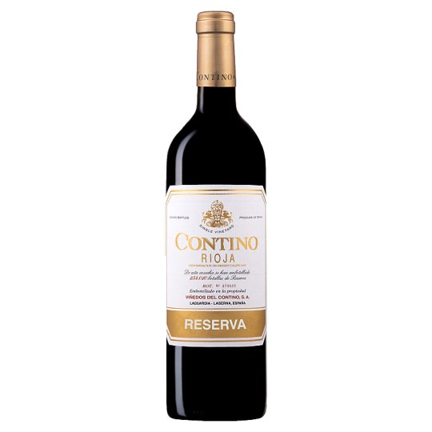
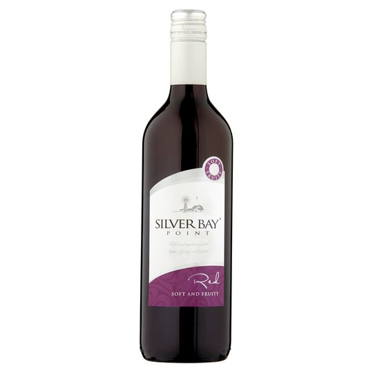

Being that there is hundreds of brands and even more variants, it is hard for wine to stand out. With the main indicator of quality being the price tag, to what extent does typography and branding influence the purchase?

When trying to determine the quality of a bottle of wine, your eye is immediately drawn to the cost. But what about the typography? I believe this says a great deal about the kind of wine being marketed. Comparing the typography of the most expensive and least expensive red wine from Tesco, you can see the difference in the appearance of both bottle labels.

Looking at the fonts, although you can see the clear disparity between them, the bottle of Silver Bay is attempting to increase its appeal by using a serif font with high contrast. It has done this to appear higher quality as it displays formal characteristics, appealing to the higher class. Unfortunately, the simplicity of the rest of the label contradicts this aim, as it looks cheap. In comparison, the bottle of Contino, displays true elements of quality and worth. With its font being even more so serif and high contrast, not to mention the gold