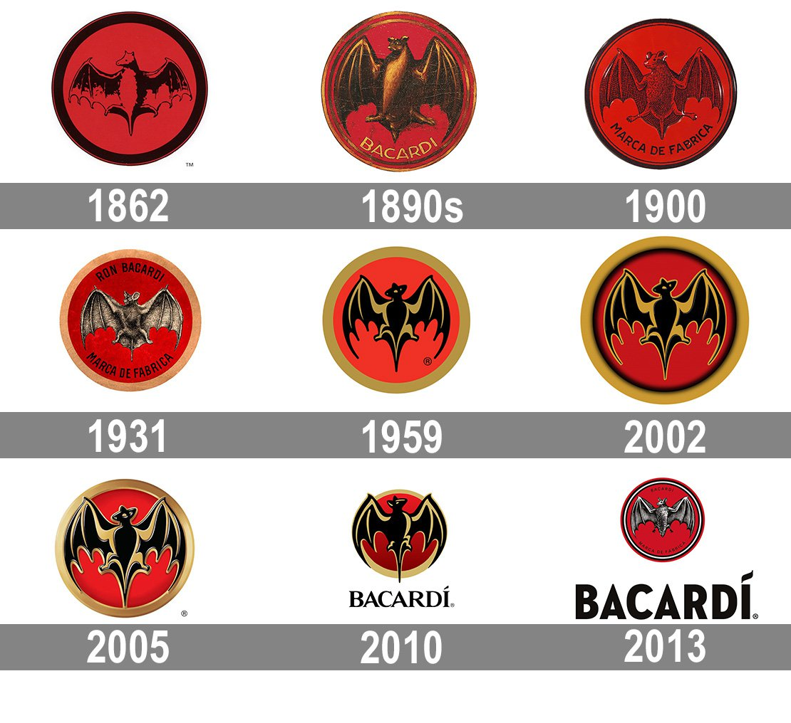
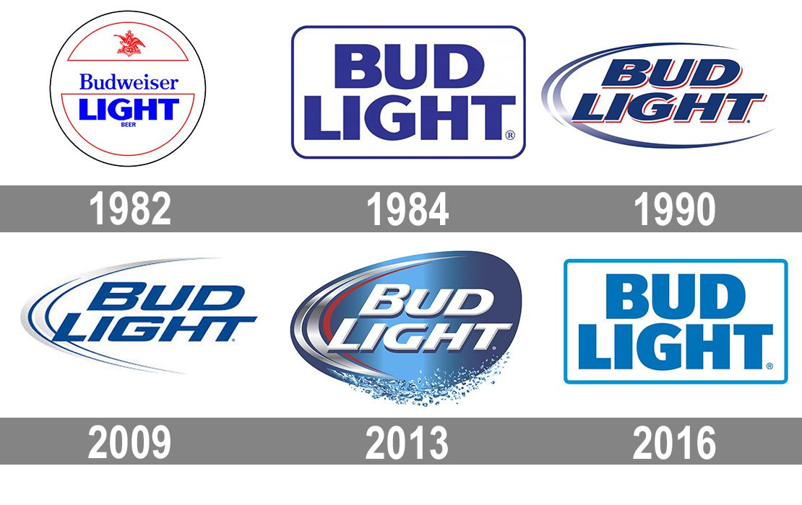
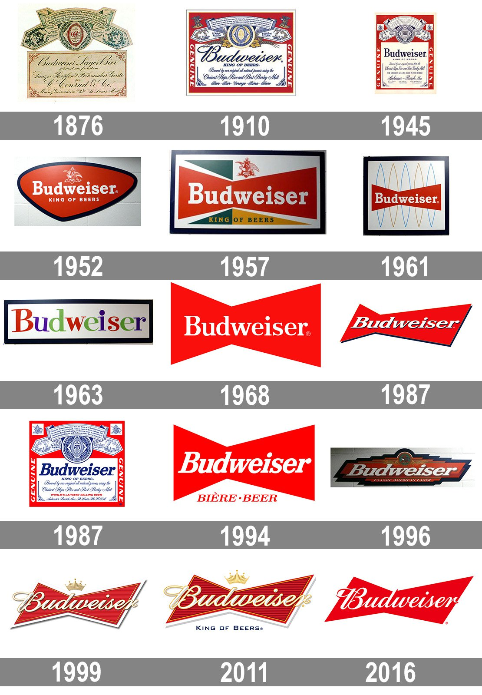
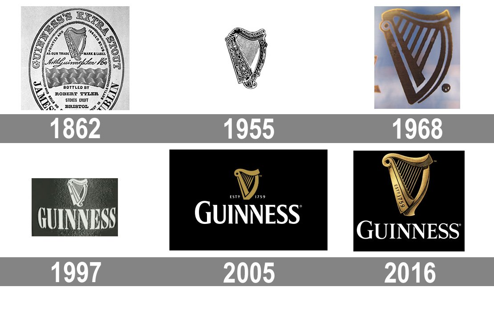

Over time, alcohol brands evolve their image to suit modern trends and designs, a key component of this image is their typography.

A company logo is the face of the brand, the typography of this logo is the most important part, as many companies have come to learn. 

Below you can see Barcardi’s brand evolution, it is clear that they discovered how important typography was for their brand image. Before their current well known gothic, low contrast font; Bacardi relied solely on their logo, which didn’t well portray the type of product it provided. And so evolved its logo and typography to have more distinct character.

Typography across the alcohol market varies with the different types you can buy. Spirits differ from beer and wine. Beer such as Bud Light and Budweiser have to compete in a huge market of other beer brands, therefore have to constantly keep up with modern trends. Bud Light in a newer beer to hit the scene compared to its parent beer Budweiser. The difference between these two is that Bud Light advertises itself as a healthier drink with fewer calories, carbs and protein; therefore tries to show this in its design. As you can see below, its colours are blue and white, which evolves from a dark blue to a lighter one, this is the colour of calmness and serenity: denotes health. Whereas, Budweiser uses the colour red which is the colour of strength and energy, it is seen as a manly drink.

The typography of these beers are even more important to their identity than the colouring. Bud Light began by using the same font as Budweiser, but as it grew in popularity, it gradually created a more individualistic style which was modern and bold. Whereas, Budweiser maintained its classic, curly contrasting font which has served them well. The advantage of this typography is that it gives the impression the beer is of high quality and expensive. When in actual fact it is quite a cheap brand of beer: the typography sets it out from the crowd of other cheap beer. Budweiser has only slightly modernised over time as newer trends came around. They did this because their brand was already so successful and well established they didn’t need to change their image too much.

On the other hand, Guinness is a very successful UK based stout. Its iconic logo and typography has barely changed over the years due to its lack of competition. The style of its typography is simple and plain, not very contrasting, not too bold or too light, and only slightly serifed. Guinness is an acquired taste, therefore has used its classic branding from its establishment to become the iconic stout to drink.