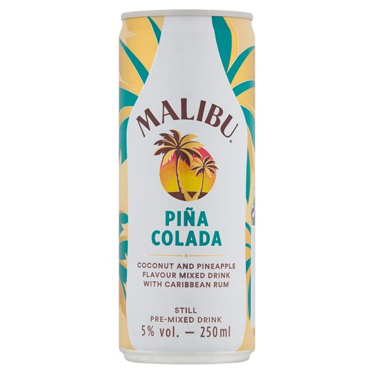
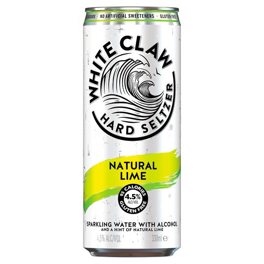
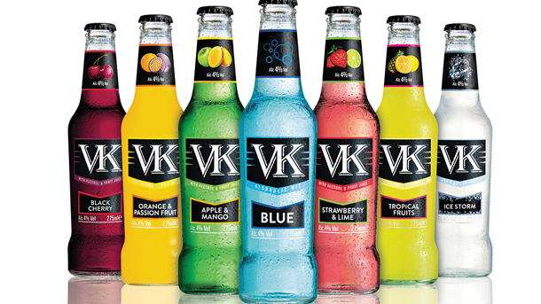

Cocktail in a can, hard seltzer, pre-mixed spirits, and florescent coloured liquid in small bottles. Once thought to be cheap, tacky, sugary gunk: now trending in youth culture.

Ready-to-drink beverages (RTDs) are associated with social connection, convenience, and style. Its aesthetically pleasing packaging and marketing appeals to young consumers. From my experience growing up, RTDs are used as gateway alcoholic drinks, they are drinks that parents feel comfortable giving to their teens for social gatherings and parties, due to the low alcohol content. Whereas, when transitioning into the drinking culture at university, these alcopops go from being a childish drink to being a means to an inebriated night out. The ease at which these beverages can be drunk makes them a staple for sports socials, where let's say you have ‘little’ choice in how much and how quickly you must drink.

## **Cocktail in a Can**

When it comes to the recently trending cocktails in cans, they are cheap, tasty and exotic. If you want to make cocktails at home, you need around 5 different types of expensive spirits as well as the mixers and other small ingredients: expensive. Ready-made cocktails in cans take away the expense and time-consuming process of making them. The market aim for these products is to sell to all ages, both young and old. It is not a difficult task to innovate typography for these drinks, they all just need to be clear, colourful and suit the vibe of that particular cocktail. For example, the Malibu Pina Colada follows the standard Malibu branding, but adds an exotic element of a turquoise can and typography.

## Hard Seltzer

Hard seltzer has become a cult new drink in America. These drinks are made up of sparkling water, alcohol and flavouring: a healthy alternative to RTDs. They are advertised as a healthy way of drinking, which is why they are so popular in America. However, they are not as well received in the UK. The typography used in these drinks is very well done, the simplicity of the bold black font perfectly characterises what the drinks provide. Nothing about the typography is responsible for its successes in the UK: the drinking culture in the UK is very different from America.

## VK

VKs are the go-to drink for clubbers in the UK. You won’t see a single student without at least one of these cheap, tasty drinks in their hands whilst jumping around in a club with their friends. The reputation these RTDs have attained in universities has become so renowned, The Advertising Standards Authority has received complaints that the advertising of VKs was promoting bad drinking habits which is “socially irresponsible”.

The typography of these drinks is simple yet edgy, given that the name only has two letters, there is only so much you can do with them. The white lettering against the black tells us that these are night drinks, they suit the clubbing setting; the vibrancy of the drink colour against the black and white gives the impression of the lighting you find in clubs. The style of the font is professional, with the high contrast and serifs, you don’t look at the drinks and think childish.