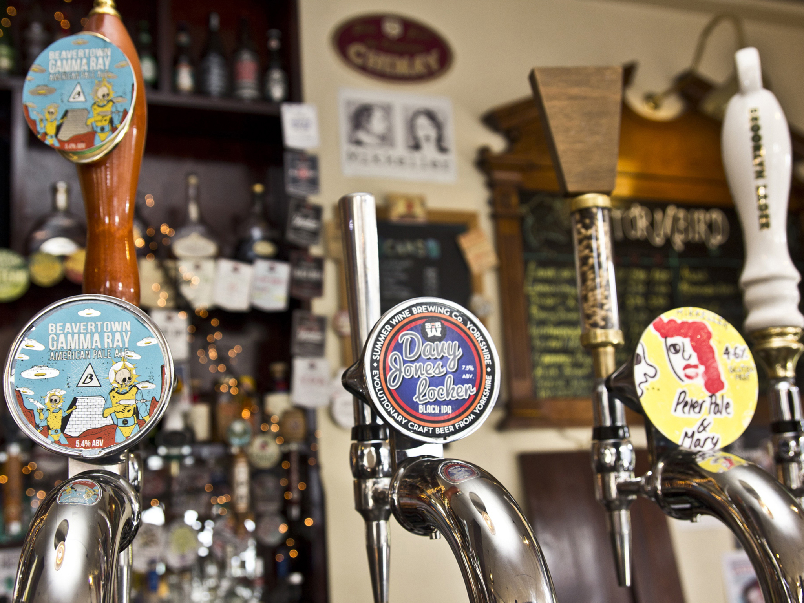
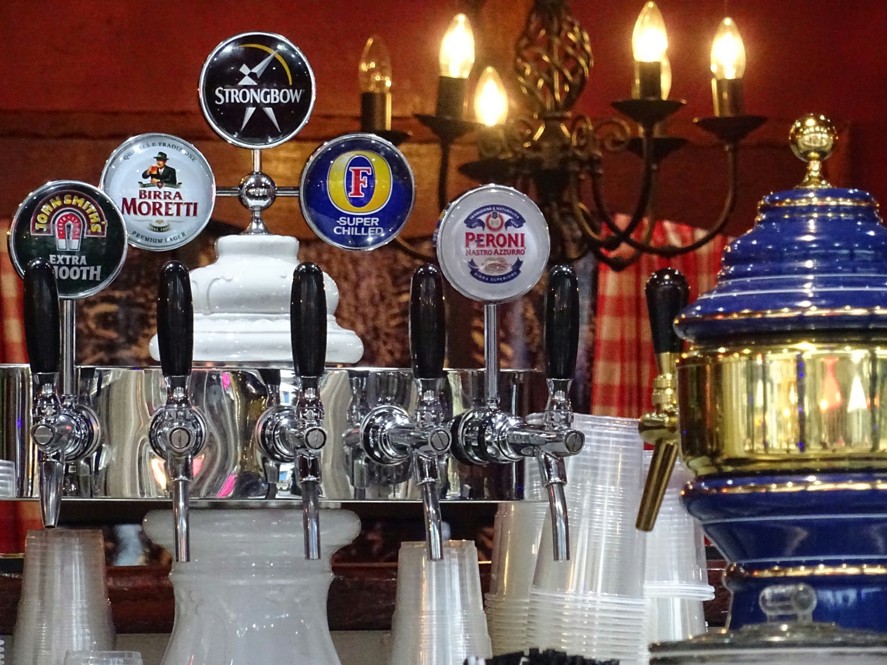

Pubs and bars are the central hub for alcohol consumption. But what can a brand do to make their product stand out? When it comes to beer, beer taps are key. The imagery found on the taps themselves is what draws consumers in.

When walking into a pub the first thing you see is the bar, which has sat on top of it a shiny row of beer taps. And as you’re stood trying to decide what to order, you’re stuck with an agony of choices. This is where the handles themselves come to play, even though you might not believe it, the design and typography on these handles influences your decision a great deal.

Over the past 24 months, craft beer sales in Britain have increased by a fifth. This is impressive, considering craft beer is a type of beer made in a traditional or non-mechanised way by a small brewery: not exactly well-known brands. Craft beers have become a trend in today’s generation of hipsters, due to the fact they were not considered culturally mainstream.

As you can see above, the three craft beers displayed are Beavertown Gamma Ray, Davy Jones Locker and Peter Pale & Mary. The quirkiness and colour of the imagery and typography on these taps draw people in and fills them with intrigue. With the two craft beers to the right, you can see the typography is styled like handwriting, these companies did this to emphasise their identity: being a craft beer. Since craft beers are created from small breweries, they are unlikely to be able to afford professional brand designers like big-name beers. Whereas, the craft beer on the left has more graphically advanced imagery and typography, which indicates to the consumer that it is more upmarket. 

On the other side of the bar, you will find the standard beer taps, where you can expect to see drinks such as; Fosters, Peroni, Stella Artois, Budweiser as well as Guinness and Strongbow. Above you can see one of these taps, featuring some of those big names. Even though craft beers have a certain draw to them, the sale of standard beers usually come out on top as they are reliable and well known. Big companies don’t need to be innovative with their imagery and typography as their iconic branding speaks for itself. For example, above you have Strongbow, Morretti and Fosters; all of which use clear professional lettering, they are bold and bright. Fosters especially stands out because of its choice of colours, it has used the complimenting colours blue and yellow to show a harsh contrast between the typography and the background. However, on another tap handle, you can see John Smiths, which is not as clear as the others, they should’ve made a statement with the typography to create a stronger brand identity: it is being overshadowed by the other beers.