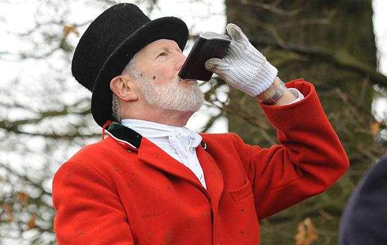
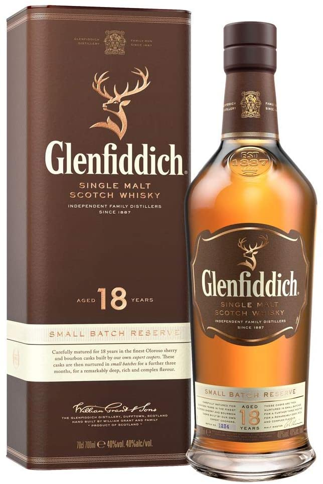
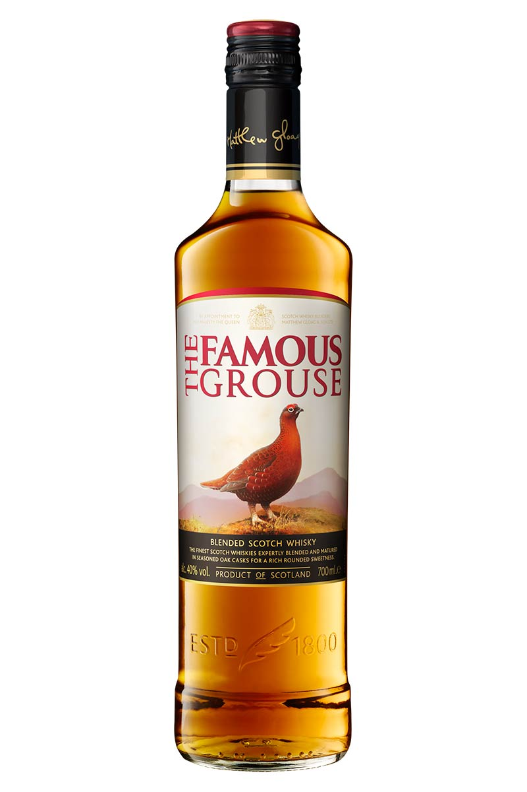
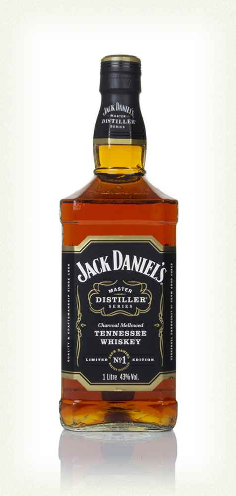

Whisky drinking is a culture. A culture that is different across all countries and cultures. The origin-country of whisky brands resonate with their typography and design.

In the UK the culture is heavily agricultural. The activities that come from living in the countryside or working in agriculture go hand in hand with drinking whisky. Believe me, having grown up with this lifestyle I went to countless hunts and shoots, where everyman had a hip flask full of whisky on him. This is where I believe the stigma behind whisky being a man's drink comes from.

