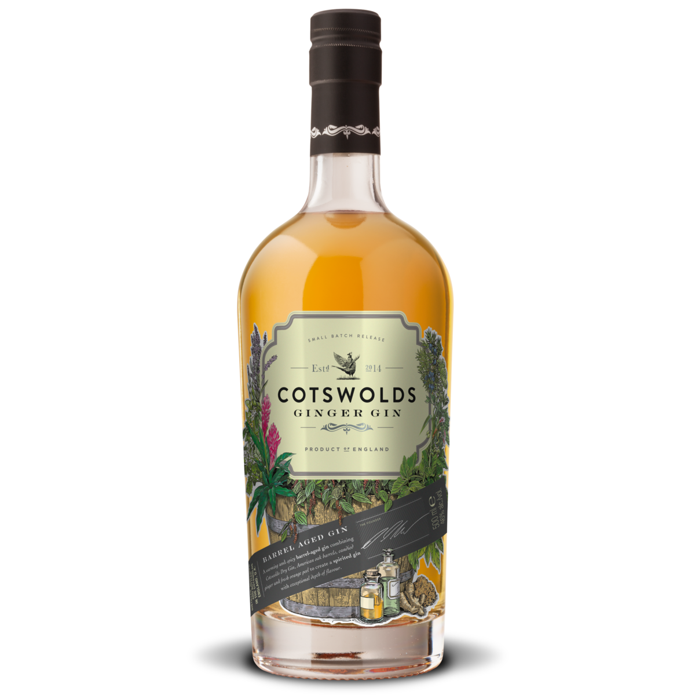
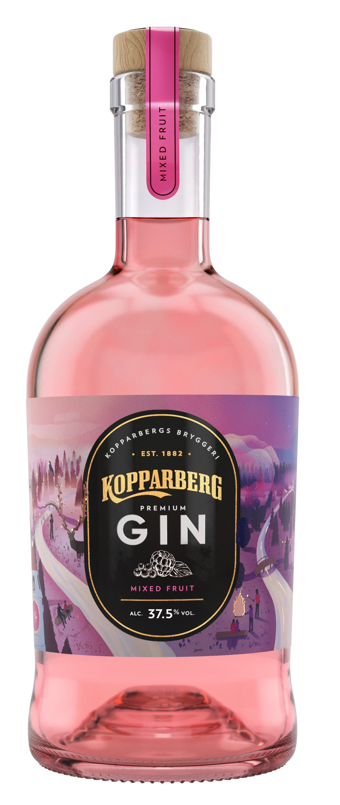
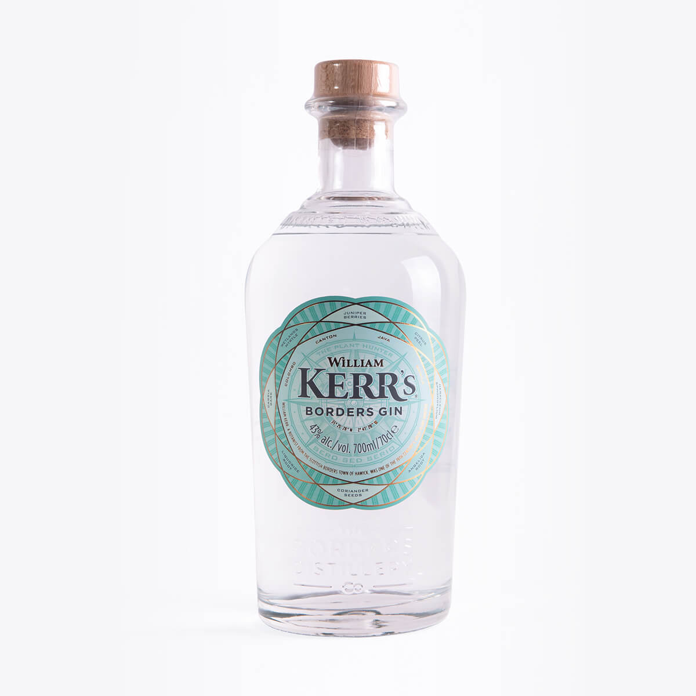

People see gin as a women’s drink. Now, this could be because twice as many women would choose gin as their favourite spirit than a man or it could because a much larger amount of women drink it. However, maybe we have just been brainwashed to think that. It is all about marketing and typography.

Gin is no doubt the most popular spirit we have in the UK today. The innovation of weird and wacky flavours has created a new market for gin to be sold in. In the past, giving spirits such as gin or vodka as a gift was seen as unsavoury or distasteful. However, due to the new styles and flavours, gin is considered a classy and expensive gift. People even started to collect bottles of the liquor from small distilleries across the UK that distribute very small quantities, making it rare. 

Distilleries and producers have experimented with different flavours of gin for years, however recently Britain has gone bananas for gin. The growth has been phenomenal, total gin sales in the UK rose to £1 billion in 2016, and the number of distilleries has increased by 127% in five years to 315 in total. When browsing the aisles of a supermarket you will see more bottles of gin than you would any other type of spirit. 

Some examples of the niche gins you can find are below:

Here we have gin from Cotswolds, Kopparberg and William Kerr’s. These three gins are all very different in their own special way, as you can see the shape of the bottles are all quite unique, yet all share the same basic ‘large body, thin neck’ silhouette of most niche gin brands. You would think the contents of the bottles are essential to the buying process, however, you’d be surprised how little influence that has on the consumer. Women are more influenced by the gin on offer when choosing which to purchase. As well as this, the design and typography have a big influence over the buyer: the more expensive looking the gin on the outside, the more likely someone is to buy it as a gift. William Kerr’s and Cotswolds are perfect examples of this, Cotswold’s detail on the label and the fact the flavour is shown to be ginger is so niched that it must be expensive. William Kerr's shows how good use of typography can make a brand seem high-end, this bottle of gin is pretty ordinary, however, the detail of the design and the contrasting serifed font tells another story. Whereas Kopparberg isn’t so much an example of good taste but an example of how more and more alcohol brands are branching out into different types of alcohol production. Kopparberg was originally just a cider producer, however, have recently released a line of flavoured gins. They are likely to be successful due to their vast resources meaning they can price their new product at a cheaper rate. Leading to more sales.