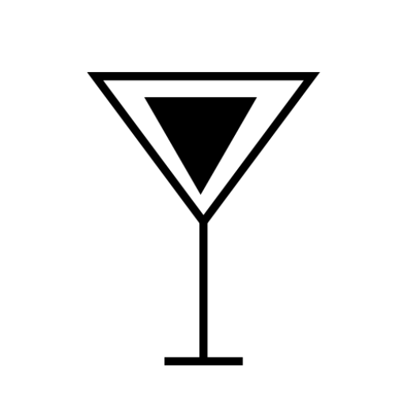

Booze Blog is a place where alcohol meets analysis. It's a blog that looks into the typographic and design choices behind some of the most renowned alcohol brands in the UK. 

When deciding what subject matter to write about, I was inspired by my time in the first national lockdown when I painted a large composition consisting of 16 alcohol logos. Due to the amount of time I spent researching which logos to paint, I became very familiar with the various brands and logos. Not to mention the fact I am a university student, which is indeed an alcohol focused lifestyle.

For the original design of this blog, I initially constructed an alcohol-themed logo, favicon and banner image using Adobe Illustrator. Unfortunately, after having written a few blog posts I realised the theme I was conveying with them did not suit the blog design anymore. I was aiming for a sleek and sophisticated theme for my blog; however, the original design was more on the fun side, it had a juvenile essence. So, I reimagined the previous design to created a simpler version which is more flexible and better suited.

## **The Logo**

For the logo, I decided to make it bold and clear as the logo icon on the title page is quite small. I chose black and white as it won't clash with any colours I choose to use in the blog posts and are the most contrasting colours; therefore the boldest.

## Favicon Image

I decided to go in a different direction for the favicon icon, as I wanted it to be more recognisable from the tabs on the toolbar. So instead, I opted for a cocktail glass which I created in Abode Illustrator. I also did this because I wanted to add a graphic element to my blog design: not just plain black and white words.

## Banner Image

I played around with the banner image for this blog many times, trying to see what worked and what did not. I tried just plain black and white, but that didn't suit the theme of the blog posts and also seemed a bit boring. It didn't tell you anything about the blog or what it's about. So I went with a high-quality image I got off Unsplash along with the simple cocktail glass I created for the favicon image, as well as the name of the blog. I believe this adds interest and story to the title page.